# rekha-chitra

`rekha-chitra` ( `रेखा-चित्र` in Devanagari script) roughly translates to `Graph` within limited context. This is a
simple graph library written in `Go`. It provides simple APIs to create and manipulate graphs.
It is a work in progress and is not ready for production use.

# Highlights

1. Uses adjacency list representation for graphs. i.e. map[string]Dependents where `type Dependents map[string]bool`
1. Provides APIs to create graph, add or replace a node, delete a node along with its edges, find candidates (think of
   them as leaves in a tree)
1. It is concurrent safe. It uses `sync.RWMutex` to protect the graph data structure while both reading and updating the
   graph
1. Keeps things simple by not providing any fancy algorithms to traverse the graph. It is left to the user to implement
   their own algorithms

# Limitations

1. The library relies on user's judgement to ensure that the graph is acyclic. It does not provide any mechanism to
   detect cycles.
1. The library assumes that the graph is created correctly. It does not provide any mechanism to validate the graph
   structure.

# Illustration

Below is an illustration of a graph with nodes marked from `node-1 .. node-10`. These nodes are connected to each other
via arrows. The arrows indicate the direction of the connection. For example, `node-1` is connected
to `node-4`, `node-5`, `node-6`. The head of the arrow points to the dependents of source node. It means that `node-1`
cannot be processed until the 3 dependent nodes are processed and removed from the graph.

* All the nodes marked in color `red` are the initial set of prune candidates.
* All prune candidates that can be processed in parallel.
* Once a node is processed, it should be removed from the graph along with its edges.
* This results in a new set of prune candidates. The new set of prune candidates are marked in color `yellow`.
* The process continues until the graph is empty.

## Flow

* `GetPruneCandidates()` -> `node-4`, `node-5`, `node-6`,`node-8`, `node-9`, `node-11`

Let us prune all the candidates.

* `PruneNodes(node-4, node-5, node-6, node-8, node-9, node-11)`

* `GetPruneCandidates()` -> `node-1`, `node-2`, `node-3`,`node-10`

Let us prune all the candidates.

* `PruneNodes(node-1, node-2, node-3, node-10`

* `GetPruneCandidates()` -> `node-7`

Let us prune all the candidates.

* `PruneNodes(node-7)`

